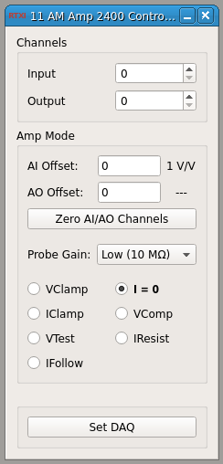

### AM Amp 2400 Controller

**Requirements:** None  
**Limitations:** None  

<!--start-->

Controls the AM Amp 2400 amplifier by scaling the gains on the analog
input/output channels and sending a mode telegraph to set the amplifier mode
(custom).

Also enables scaling of custom AO offsets based on the gains of the selected
amplifier mode.

<!--end-->

#### Input
1. input(0) - I=0 Input from AI : Empty signal from analog input for
   'calibrating' the input channel for I=0.
2. input(1) - I=0 Input from AO : Empty signal from analog output for
   'calibrating' the output channel for I=0.

#### Output
1. output(0) - Mode Bit 1 : Bit 1 of signal sent to amplfier
2. output(1) - Mode Bit 2 : Bit 2 of signal sent to amplfier
3. output(2) - Mode Bit 4 : Bit 4 of signal sent to amplfier

#### Parameters
1. Input Channel - Input channel to scale (#)
2. Output Channel - Output channel to scale (#)
3. Amplifier Mode - Mode to telegraph to amplifier
4. Probe Gain - Gain - HIGH (10 MOhm) or LOW (10 GOhm)
5. AI Offset - Offset the amplifier scaling (entered manually or computed based
   on current amplifier mode)
6. AO Offset - Offset the amplifier scaling (entered manually or computed based
   on current amplifier mode)

#### States

